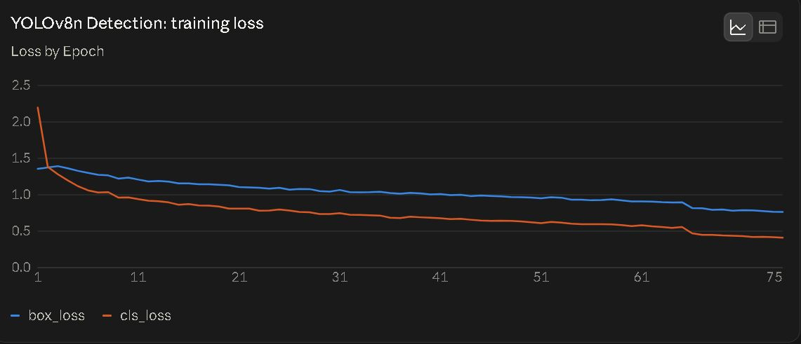
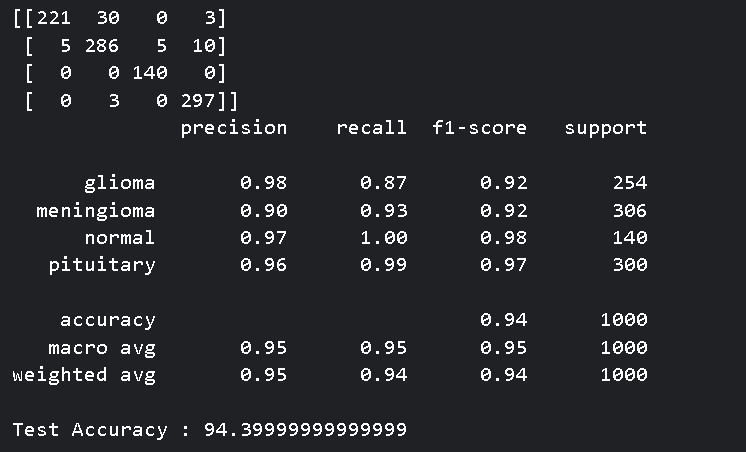

# Brain Tumor Detection, Classification & Localization (BRISC)

A computer vision pipeline for brain MRI analysis, combining classification and object detection to identify tumor type and location from MRI scans. Built using the BRISC dataset.

## How it works

The pipeline runs two models in parallel on an input MRI scan:

1. **Classification** EfficientNet-B3 model classifies the scan into one of four categories: glioma, meningioma, pituitary, or normal (no tumor).
2. **Object detection** YOLOv8n model draws a bounding box around the tumor and estimates its approximate pixel area.
3. **Interpretability** Grad-CAM visualizes which regions of the scan the classification model actually attended to, used during development to catch a shortcut-learning issue (see below).

## Results

| Task | Metric | Score |
|---|---|---|
| Classification | Test accuracy | 94.4% |
| Detection | mAP50 | 0.92 |
| Detection | mAP50-95 | 0.67 |
| Detection | Recall @ conf 0.5 | 0.87 |
| Detection | False positive rate @ conf 0.5 | 0.0019 |






The confusion matrix shows a specific, one-directional misclassification pattern: roughly 12% of glioma cases are predicted as meningioma, with no meaningful error in the reverse direction

## A debugging catch worth highlighting

Grad-CAM interpretability analysis surfaced a shortcut-learning issue during development, the classification model was found to be exploiting spurious image features rather than genuine pathology in an earlier iteration of this project (carried over from a prior chest X-ray classification project where the same failure mode was first caught). This directly shaped dataset selection and evaluation strategy for this project. Grad-CAM output is included in the inference script's visualization for exactly this reason, not just as a nice-to-have overlay, but as an ongoing check against the model learning the wrong thing.

## Repository structure

```
project-root/
├── README.md
├── requirements.txt
├── data/
│   ├──........
├── src/
│   ├── preprocess.py        # derives YOLO-format bounding box labels from ground-truth tumor masks
│   ├── training_cls.py      # classification model training
│   ├── training_obj.py      # Yolo model training
│   └── inference.py         # runs classification + Grad-CAM + detection on a sample image
├── sample_data/
│   └── gl1.jpg               # sample MRI scan(s) for the quick demo
├── weights/
│   ├── cls.pth
│   └── objectdetection.pt
└── results/
    ├── losses.JPG
    └── confusion.JPG
    └── mAP50-mAP50-95.JPG
```

## Setup

```bash
pip install -r requirements.txt
```

**GPU/CUDA note**: the pinned `torch` version installs CPU-only by default via plain `pip install`. For GPU support, install the correct CUDA-matched build separately by following the command for your system at https://pytorch.org/get-started/locally/. Inference and training both run on CPU automatically if no GPU is available, just slower.

### Full dataset (for training/evaluation)

1. Download the BRISC dataset.
2. Set the `DATA_ROOT` environment variable to point to it, or place it at `./data/dataset`.

## Quick demo (no dataset download needed)

Runs classification, Grad-CAM, and detection on a bundled sample MRI image:

```bash
python src/inference.py
```

Set `WEIGHTS_PATH` and `SAMPLE_PATH` environment variables to override the default `./weights` and `./sample_data` locations.

## Notes

- The classification model's glioma is meningioma confusion (visible in the confusion matrix above) is one-directional and consistent, suggesting a genuine feature-overlap issue between those two tumor types in this dataset rather than random noise.
- Detection training curves show the model plateauing around epoch 45-50, with the remaining epochs providing negligible further gains
- The area estimate produced by the detection model in `inference.py` is a rough approximation based on the bounding box's area, not the tumor's actual pixel footprint, and may be inaccurate for irregularly shaped tumor, it's included as a secondary feature, not a primary one.
